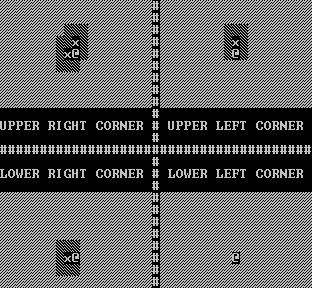

### 3.4.5. [shadowFunctions.h](../../headers/rendering/shadowFunctions.h)
###### This section was last checked in the 2.0.2. version of the engine
This header contains functions that prepare for the shading of the correct parts of the game world, and also [the function that actually shades the correct places](#34514-shadowfunction).
#### 3.4.5.1. makeCurrentFov
###### This section was last checked in the 2.0.2. version of the engine
```cpp
//   This function copies one FOV array into another.
void makeCurrentFov(fov presetDir[FOVROWS][FOVCOLS], fov toBeDir[FOVROWS][FOVCOLS])
{
	//   The function loops through all the variables on the array.
	for (int i = 0; i < FOVROWS; i++)
	{
		for (int j = 0; j < FOVCOLS; j++)
		{
			//   The function copies the correct sub variables of the current variable of
			// the array.
			toBeDir[i][j].inView = presetDir[i][j].inView;
			toBeDir[i][j].isPlayer = presetDir[i][j].isPlayer;
		}
	}
}
```
**Usage:** This function copies a [FOV array](3.3._Variables_in_the_main_.cpp_file.md/#3316-fov-arrays) into another [FOV array](3.3._Variables_in_the_main_.cpp_file.md/#3316-fov-arrays).

**Variables:**

* **presetDir:** This is the [FOV array](3.3._Variables_in_the_main_.cpp_file.md/#3316-fov-arrays) that gets copied.
* **toBeDir:** This is the [FOV array](3.3._Variables_in_the_main_.cpp_file.md/#3316-fov-arrays) that gets overwritten.

**How it's done & notes:** The function loops through each variable of the arrays, and copies the different sub variables from one to the other. For more information about the fov structure click [here](3.2._Structures.md/#323-fov).

#### 3.4.5.2. setCurrentFov
###### This section was last checked in the 2.0.2. version of the engine
```cpp
//   This function sets the correct FOV for the player according to its orientation.
void setCurrentFov(mob playr, fov toBecomeCurrentFov[FOVROWS][FOVCOLS], fov r[FOVROWS][FOVCOLS], fov l[FOVROWS][FOVCOLS], fov u[FOVROWS][FOVCOLS], fov d[FOVROWS][FOVCOLS], fov ru[FOVROWS][FOVCOLS], fov rd[FOVROWS][FOVCOLS], fov lu[FOVROWS][FOVCOLS], fov ld[FOVROWS][FOVCOLS])
{
	//   The function checks all of the 8 possibilities and sets the correct FOV for the 
	// player.
	
	if (playr.right && !playr.up && !playr.down)
	{
		makeCurrentFov(r, toBecomeCurrentFov);
	}
	
	if (playr.right && playr.up)
	{
		makeCurrentFov(ru, toBecomeCurrentFov);
	}
	
	if (playr.right && playr.down)
	{
		makeCurrentFov(rd, toBecomeCurrentFov);
	}
	
	if (playr.left && !playr.up && !playr.down)
	{
		makeCurrentFov(l, toBecomeCurrentFov);
	}
	
	if (playr.left && playr.up)
	{
		makeCurrentFov(lu, toBecomeCurrentFov);
	}
	
	if (playr.left && playr.down)
	{
		makeCurrentFov(ld, toBecomeCurrentFov);
	}
	
	if (playr.up && !playr.right && !playr.left)
	{
		makeCurrentFov(u, toBecomeCurrentFov);
	}
	
	if (playr.down && !playr.right && !playr.left)
	{
		makeCurrentFov(d, toBecomeCurrentFov);
	}
}
```
**Usage:** This function sets the current [FOV array](3.3._Variables_in_the_main_.cpp_file.md/#3316-fov-arrays) to the correct [FOV array](3.3._Variables_in_the_main_.cpp_file.md/#3316-fov-arrays) according to the input.

**Variables:**
* **playr:** This variable holds the needed information about the input.
* **toBecomeCurrentFov:** This array will contain the correct [FOV array](3.3._Variables_in_the_main_.cpp_file.md/#3316-fov-arrays) according to this frame's inputs.
* **r:** This array holds the information about how the FOV looks when the player is looking to the right.
* **l:** This array holds the information about how the FOV looks when the player is looking to the left.
* **u:** This array holds the information about how the FOV looks when the player is looking upwards.
* **d:** This array holds the information about how the FOV looks when the player is looking downwards.
* **ru:** This array holds the information about how the FOV looks when the player is looking upwards and to the right.
* **rd:** This array holds the information about how the FOV looks when the player is looking downwards and to the right.
* **lu:** This array holds the information about how the FOV looks when the player is looking upwards and to the left.
* **ld:** This array holds the information about how the FOV looks when the player is looking downwards and to the left.

**How it's done & notes:** The function checks each of the 8 cases one by one and then copies the correct FOV array into the toBecomeCurrentFov array, with the use of [the makeCurrentFov function](#3451-makecurrentfov).

#### 3.4.5.3. getPlayerPosInFov
###### This section was last checked in the 2.0.2. version of the engine
```cpp
//   This function gets the position of the player from a FOV array.
mob getPlayerPosInFov(mob playr, mob fovPlayr)
{
	//   The function hardcodes the correct row and col(umn) values for the player 
	// according to its orientation.
	
	if (playr.right && !playr.up && !playr.down)
	{
		fovPlayr.row = 10;
		fovPlayr.col = 1;
	}
	
	if (playr.right && playr.up)
	{
		fovPlayr.row = 14;
		fovPlayr.col = 7;
	}
	
	if (playr.right && playr.down)
	{
		fovPlayr.row = 6;
		fovPlayr.col = 7;
	}
	
	if (playr.left && !playr.up && !playr.down)
	{
		fovPlayr.row = 10;
		fovPlayr.col = 33;
	}
	
	if (playr.left && playr.up)
	{
		fovPlayr.row = 14;
		fovPlayr.col = 27;
	}
	
	if (playr.left && playr.down)
	{
		fovPlayr.row = 6;
		fovPlayr.col = 27;
	}
	
	if (playr.up && !playr.right && !playr.left)
	{
		fovPlayr.row = 20;
		fovPlayr.col = 17;
	}
	
	if (playr.down && !playr.right && !playr.left)
	{
		fovPlayr.row = 0;
		fovPlayr.col = 17;
	}
	
	return fovPlayr;
}
```
**Usage:** This function sets where the player is in the [FOV array](3.3._Variables_in_the_main_.cpp_file.md/#3316-fov-arrays) according to the orientation of the player, or in other worlds which FOV does the player currently use.

**Variables:**
* **playr:** This variable holds the needed information about the input.
* **fovPlayr:** This variable will hold where the player is in the current [FOV array](3.3._Variables_in_the_main_.cpp_file.md/#3316-fov-arrays).

**How it's done & notes:** The function checks each of the 8 cases one by one, then hardcodes the correct values into the .col and .row sub variables of the fovPlayr variable. For more information about the mob structure click [here](3.2._Structures.md/#321-mob). The information from this fovPlayr variable will be used as an anchor point by [the function that adds the information from the current FOV array into the map](#3454-addfovinfotomap). A better implementation of this function is planned for the 3.0.0. update!

#### 3.4.5.4. addFovInfoToMap
###### This section was last checked in the 2.0.2. version of the engine
```cpp
//   This function makes the correct cells visible on the map according to the current
// FOV of the player.
void addFovInfoToMap(map world[WORLDROWS][WORLDCOLS], mob playr, mob fovPlayr, fov fov[FOVROWS][FOVCOLS])
{
	//   First the function loops through every cell on the world map.
	for (int i = 0; i < WORLDROWS; i++)
	{
		for (int j = 0; j < WORLDCOLS; j++)
		{
			//   The function sets the current cells visibility to false (a cell can only
			// be .mapIsEdge if it isn't in view so .mapIsEdge gets set to false too).
			world[i][j].mapIsEdge = false;
			world[i][j].mapInView = false;
		}
	}
	
	//   Next the function loops over the current FOV array of the player.
	for (int i = 0; i < FOVROWS; i++)
	{
		for (int j = 0; j < FOVCOLS; j++)
		{
			//   The function checks if the current cell of the FOV array is in view, if
			// it is we set the correct cell of the world map to in view too. We do this 
			// by using the position of the player in the FOV array as ana nchor point
			// between the FOV and the map. So the cell in the upper left corner of the
			// FOV array is obviously (0,0) and the cell in the upper left corner of the
			// FOV array in the map (as anchored by the player) is:
			// (player.row - fovplayer.row, player.col - fovplayer.col).
			if (fov[i][j].inView)
			{
				world[playr.row - fovPlayr.row + i][playr.col - fovPlayr.col + j].mapInView = true;
			}
		}
	}
}
```
**Usage:** This function adds the information from [the current FOV array](3.3._Variables_in_the_main_.cpp_file.md/#3317-currentfov) about the different cells (if they are visible or not) into the map of the world.

**Variables:**

* **world:** This array will hold the information if the cell is in view or not, for all of the cells in the world.
* **playr:** This variable holds the position of the player in the world.
* **fovplayr:** This variable holds the position of the player in [the current FOV array](3.3._Variables_in_the_main_.cpp_file.md/#3317-currentfov).
* **fov:** This array holds information about the current FOV of the player. 

**How it's done & notes:** First the function sets all of the cells to not visible in [the world array](3.3._Variables_in_the_main_.cpp_file.md/#3320-newworld). Then we start looping over a chunk of the world which in size equals that of [the FOV ararys](3.3._Variables_in_the_main_.cpp_file.md/#3316-fov-arrays). If a cell in [the current FOV array](3.3._Variables_in_the_main_.cpp_file.md/#3317-currentfov) is in view we set the correct cell in the world to in view. We do this with the help of our anchor point. Since the anchor point is the position of the player in [the current FOV array](3.3._Variables_in_the_main_.cpp_file.md/#3317-currentfov), if we subtract it from the player's position in the world we get the top left point of the FOV of the player in the world. After that we can just simply loop over every cell of [the current FOV array](3.3._Variables_in_the_main_.cpp_file.md/#3317-currentfov) by adding i and j to the correct dimensions.  

#### 3.4.5.5. getPov
###### This section was last checked in the 2.0.2. version of the engine
```cpp
//   This function gets the Point Of View (or POV) of the player according to its cell
// position.
koordinate getPov(koordinate pov, mob playr)
{
	//   The function adds .5 to both of the cell coordinates of the player.
	pov.x = playr.col + 0.5;
	pov.y = playr.row + 0.5;

	return pov;
}
```
**Usage:** This gets the point of view from which the player "sees" things.

**Variables:**
* **pov:** This variable will contain the coordinates of the point from which the player "sees" things.
* **playr:** This variable holds the position of the player in the world.

**How it's done & notes:** We just simply add 0.5 to the position of the player. Since we will cast lines to the edges of different cells in [the function that shades things](#34514-shadowfunction), and since the edges of the cells all have integer coordinates for their four points, adding 0.5 to both of the coordinates of the player prevents the engine from casting lines that are vertical (vertical lines can't be described by the line equation the engine is using, for more information click [here](3.2._Structures.md/#324-line)). **Important:** the playr variable has cell coordinates in it and the pov variable will have point coordinates in it, for more information about the difference between the two click [here](2.2._How_to_use_the_editors,_and_other_further_details.md/#2232-further-ramblings-about-the-coordinate-system).

#### 3.4.5.6. getLineEquation
###### This section was last checked in the 2.0.2. version of the engine
```cpp
//   This function gets the a line that passes through two given points.
line getLineEquation(double aXCol, double aYRow, int bXCol, int bYRow)
{
	line e;

	//   The following calculations are prooven to work ro find the line that is between 
	// two points. Here is a link for manually solving a problem like this:
	// https://www.khanacademy.org/math/algebra/two-var-linear-equations/writing-slope-intercept-equations/v/equation-of-a-line-3

	e.mSlope = (bYRow - aYRow) / (bXCol - aXCol);
	e.bIntercept = aYRow - (e.mSlope * aXCol);

	return e;
}
```
**Usage:** This function determines the line that passes through two points.

**Variables:**
* **aXCol:** The x coordinate of the first point.
* **aYRow:** The y coordinate of the first point.
* **bXCol:** The x coordinate of the second point.
* **bYRow:** The y coordinate of the second point.

**How it's done & notes:** It can be proven that the operations I'm doing with those variables produce the desired values (for an explanation click [here](https://www.khanacademy.org/math/algebra/two-var-linear-equations/writing-slope-intercept-equations/v/equation-of-a-line-3) and for an explanation of the line formula the engine uses click [here](3.2._Structures.md/#324-line)). It should be noted that the second point's coordinates are set as integers, this is because I use this function to cast lines from the player to the edges of objects, and the edges of the objects are always integers (for further information about this click [here](2.2._How_to_use_the_editors,_and_other_further_details.md/#2232-further-ramblings-about-the-coordinate-system)).

#### 3.4.5.7. isUnderLine
###### This section was last checked in the 2.0.2. version of the engine
```cpp
//   This function checks if a cell is under a given line.
bool isUnderLine(line e, int solidYRow, int solidXCol)
{
	//   The function checks all of the 4 corners of the cell if they are under the line,
	// if they are the function returns true.
	if ((solidYRow <= (solidXCol * e.mSlope) + e.bIntercept) && ((solidYRow + 1) <= (solidXCol * e.mSlope) + e.bIntercept) && (solidYRow <= ((solidXCol + 1) * e.mSlope) + e.bIntercept) && ((solidYRow + 1) <= ((solidXCol + 1) * e.mSlope) + e.bIntercept))
	{
		return true;
	}

	//   If there is at least one corner that isn't under the line the function returns
	// false.
	return false;
}
```
**Usage:** This function returns true if a cell is under a line (this includes the case when the cell is just touching the line).

**Variables:**
* **e:** The line in question.
* **solidYRow:** The y coordinate of the cell.
* **solidXCol:** The x coordinate of the cell.

**How it's done & notes:** The function checks for all of the four points of the cell if its under the given line, if all four are then it returns true. For the difference between cell and point coordinates click [here](2.2._How_to_use_the_editors,_and_other_further_details.md/#2232-further-ramblings-about-the-coordinate-system). For more information about the line formula click [here](3.2._Structures.md/#324-line). I plan to implement a more optimized version of this function in the 3.0.0. update.

#### 3.4.5.8. isOverLine
###### This section was last checked in the 2.0.2. version of the engine
```cpp
//   This function checks if a cell is over a given line.
bool isOverLine(line e, int solidYRow, int solidXCol)
{
	//   The function checks all of the 4 corners of the cell if they are over the line,
	// if they are the function returns true.
	if ((solidYRow >= (solidXCol * e.mSlope) + e.bIntercept) && ((solidYRow + 1) >= (solidXCol * e.mSlope) + e.bIntercept) && (solidYRow >= ((solidXCol + 1) * e.mSlope) + e.bIntercept) && ((solidYRow + 1) >= ((solidXCol + 1) * e.mSlope) + e.bIntercept))
	{
		return true;
	}

	//   If there is at least one corner that isn't over the line the function returns
	// false.
	return false;
}
```
**Usage:** This function returns true if a cell is over a line (this includes the case when the cell is just touching the line).

**Variables:**
* **e:** The line in question.
* **solidYRow:** The y coordinate of the cell.
* **solidXCol:** The x coordinate of the cell.

**How it's done & notes:** The function checks for all of the four points of the cell if its over the given line, if all four are then it returns true. For the difference between cell and point coordinates click [here](2.2._How_to_use_the_editors,_and_other_further_details.md/#2232-further-ramblings-about-the-coordinate-system). For more information about the line formula click [here](3.2._Structures.md/#324-line). I plan to implement a more optimized version of this function in the 3.0.0. update.

#### 3.4.5.9. isBetweenLines
###### This section was last checked in the 2.0.2. version of the engine
```cpp
//   This function determines if a cell is fully between two lines.
bool isBetweenLines(line a, line b, int yRow, int xCol)
{
	//   First the function checks if the first line is an "underline" (if it is that
	// means that the line is supposed to be under the given cell).
	if (a.isItUnderLine)
	{
		//   If the first line is supposed to be an "underline" the function checks if it
		// actually goes under the given cell, if it dosen't the function returns false.
		if (!isUnderLine(a, yRow, xCol))
		{
			return false;
		}
	}
	else
	{
		//   If the first line isn't supposed to be an "underline" that means that it is 
		// an "overline", thus the function checks if the line actually goes over the
		// given cell, if it dosen't the function returns false.
		if (!isOverLine(a, yRow, xCol))
		{
			return false;
		}
	}

	//   Next the function checks if the second line is on an "underline".
	if (b.isItUnderLine)
	{
		//   If the second line is supposed to be an "underline" the function checks if
		// it actually goes under the given cell, if it dosen't the function returns
		// false.
		if (!isUnderLine(b, yRow, xCol))
		{
			return false;
		}
	}
	else
	{
		//   If the second line isn't supposed to be an "underline" that means that it is 
		// an "overline", thus the function checks if the line actually goes over the
		// given cell, if it dosen't the function returns false.
		if (!isOverLine(b, yRow, xCol))
		{
			return false;
		}
	}

	//   Finally iff the function haven't returned anything so far that means that the 
	// lines are what they are supposed to be, so the function returns true.
	return true;
}
```
**Usage:** This function returns true if a cell is between two lines (a cell is also determined to be between two lines if any of the lines touch it in just one point).

**Variables:**
* **a:** The first line. 
* **b:** The second line.
* **yRow:** The y coordinate of the cell.
* **xCol:** The x coordinate of the cell.

**How it's done & notes:** The engine checks both of the possibilities (is the line under or over the cell we are checking) for both of the lines. This is done by utilizing properties of the line structure (for more info click [here](3.2._Structures.md/#324-line)), [the isUnderline function](#3457-isunderline) and [the isOverLine function](#3458-isoverline).

#### 3.4.5.10. isMoreThanHalfInShade

###### This section was last checked in the 2.0.2. version of the engine

```cpp
//   This function checks if a line intersects a cell and if it does it checks if the
// area inside the shade is bigger than half of the area of the cell.
bool isMoreThanHalfInShade(line e, int yRow, int xCol)
{
	//   First the function checks if the line is an "underline"
	if (e.isItUnderLine)
	{
		//   If the line is an "underline" the function checks if it interests the lower
		// border of the cell.
		if (xCol - INFINITECIMAL < ((yRow + 1) - e.bIntercept) / e.mSlope && (xCol + 1) + INFINITECIMAL > ((yRow + 1) - e.bIntercept) / e.mSlope)
		{
			//   If the line intersects the lower border then the function checks if the 
			// line intersects the left border if it does it returns true.
			if (yRow < (e.mSlope * xCol) + e.bIntercept && yRow + 1  > (e.mSlope * xCol) + e.bIntercept)
			{
				return true;
			}
			
			//   If the line intersects the lower border then the function checks if the 
			// line intersects the right border if it does it returns true.
			if (yRow < (e.mSlope * (xCol + 1)) + e.bIntercept && yRow + 1  > (e.mSlope * (xCol + 1)) + e.bIntercept)
			{
				return true;
			}
		}
		
		//   If the line dosen't intersect the lower border of the cell, then the 
		// function checks if the line intersects both the left and right border of the 
        // cell.
		if (yRow - INFINITECIMAL <= (e.mSlope * xCol) + e.bIntercept && yRow + 1 + INFINITECIMAL >= (e.mSlope * xCol) + e.bIntercept && yRow - INFINITECIMAL <= (e.mSlope * (xCol + 1)) + e.bIntercept && yRow + 1 + INFINITECIMAL >= (e.mSlope * (xCol + 1)) + e.bIntercept)
		{
			//   If the line intersects both the left and right border of the cell the 
			// function cchecks if the area that is inside the shadow is bigger than 
			// half of the area of the cell, if it is the function retourns true.
			if ((e.mSlope * xCol) + e.bIntercept - yRow + (e.mSlope * (xCol + 1)) + e.bIntercept - yRow + INFINITECIMAL >= 1)
			{
				return true;
			}
		}
		
		//   If the line only intersects the lower border of the cell or it dosen't 
		// intersect both the left and the right border the function checks if the line 
		// intersects both the upper and the lower border of the cell. 
		if (xCol - INFINITECIMAL <= (yRow - e.bIntercept) / e.mSlope && (xCol + 1) + INFINITECIMAL >= (yRow - e.bIntercept) / e.mSlope && xCol - INFINITECIMAL <= ((yRow + 1) - e.bIntercept) / e.mSlope && (xCol + 1) + INFINITECIMAL >= ((yRow + 1) - e.bIntercept) / e.mSlope)
		{
			//   If the function intercepts both the upper and lower border of the cell 
			// the function checks if the segment from the top left corner of the cell to 
			// the point where the line intercepts the upper border is longer than the 
			// segment from the point where the line intercepts the upper border of the 
			// cell to the top right corner of the cell.
			if (((yRow - e.bIntercept) / e.mSlope) - xCol > (((yRow + 1) - e.bIntercept) / e.mSlope) - xCol)
			{
				//   If the segment from the top left corner of the cell to the point 
				// where the line intercepts the upper border is longer than the segment
				// from the point where the line intercepts the upper border of the cell 
				// to the top right corner of the cell the function calculates if the 
				// area left of the line inside the cell is more than half of the area of 
				// the call if it is the function returns true.
				if (((yRow - e.bIntercept) / e.mSlope) - xCol + (((yRow + 1) - e.bIntercept) / e.mSlope) - xCol + INFINITECIMAL >= 1)
				{
					return true;
				}
			}
			
			//   If the function intercepts both the upper and lower border of the cell  
			// the function checks if the segment from the top left corner of the cell to 
			// the point where the line intercepts the upper border is shorter than the 
			// segment from the point where the line intercepts the upper border of the 
			// cell to the top right corner of the cell.
			if (((yRow - e.bIntercept) / e.mSlope) - xCol < (((yRow + 1) - e.bIntercept) / e.mSlope) - xCol)
			{
				//   If the segment from the top left corner of the cell to the point 
				// where the line intercepts the upper border is shorter than the segment 
				// from the  point where the line intercepts the upper border of the cell 
				// to the top right corner of the cell the function calculates if the 
				// area right of the line inside the cell is more than half of the area 
				// of the call if it is the function returns true.
				if (((yRow - e.bIntercept) / e.mSlope) - xCol + (((yRow + 1) - e.bIntercept) / e.mSlope) - xCol - INFINITECIMAL <= 1)
				{
					return true;
				}
			}
		}
	}
	
	if (!e.isItUnderLine)
	{
		if (xCol - INFINITECIMAL < (yRow - e.bIntercept) / e.mSlope && (xCol + 1) + INFINITECIMAL > (yRow - e.bIntercept) / e.mSlope)
		{
			if (yRow < (e.mSlope * xCol) + e.bIntercept && yRow + 1 > (e.mSlope * xCol) + e.bIntercept)
			{
				return true;
			}
				
			if (yRow < (e.mSlope * (xCol + 1)) + e.bIntercept && yRow + 1 > (e.mSlope * (xCol + 1)) + e.bIntercept)
			{
				return true;
			}
		}
		
		if (yRow - INFINITECIMAL <= (e.mSlope * xCol) + e.bIntercept && yRow + 1 + INFINITECIMAL >= (e.mSlope * xCol) + e.bIntercept && yRow - INFINITECIMAL <= (e.mSlope * (xCol + 1)) + e.bIntercept && yRow + 1 + INFINITECIMAL >= (e.mSlope * (xCol + 1)) + e.bIntercept)
		{
			if ((e.mSlope * xCol) + e.bIntercept - yRow + (e.mSlope * (xCol + 1)) + e.bIntercept - yRow - INFINITECIMAL <= 1)
			{
				return true;
			}
		}
		
		if (xCol - INFINITECIMAL <= (yRow - e.bIntercept) / e.mSlope && (xCol + 1) + INFINITECIMAL >= (yRow - e.bIntercept) / e.mSlope && xCol - INFINITECIMAL <= ((yRow + 1) - e.bIntercept) / e.mSlope && (xCol + 1) + INFINITECIMAL >= ((yRow + 1) - e.bIntercept) / e.mSlope)
		{
			if (((yRow - e.bIntercept) / e.mSlope) - xCol > (((yRow + 1) - e.bIntercept) / e.mSlope) - xCol)
			{
				if (((yRow - e.bIntercept) / e.mSlope) - xCol + (((yRow + 1) - e.bIntercept) / e.mSlope) - xCol - INFINITECIMAL <= 1)
				{
					return true;
				}
			}
			
			if (((yRow - e.bIntercept) / e.mSlope) - xCol < (((yRow + 1) - e.bIntercept) / e.mSlope) - xCol)
			{
				if (((yRow - e.bIntercept) / e.mSlope) - xCol + (((yRow + 1) - e.bIntercept) / e.mSlope) - xCol + INFINITECIMAL >= 1)
				{
					return true;
				}
			}
		}
	}

	return false;
}
```

**Usage:** This function determines if a line intersects a cell and if it does the function determines if more than half of the area of the cell is inside the "shaded" section of the cell (the borders of this section is the line itself and the border of the cell).

**Variables:** 

* **e:** The line that you are checking with.
* **yRow:** The cell's y coordinate.
* **xCol:** The cell's x coordinate.

**How it's done & notes:** The function is symmetrical if the line is under the shaded place or above it, so for the purposes of this explanation I'm only going to talk about the first option. First the function checks if the line is under the shaded bit. If it is the function then checks if the line intersects the borders of the cell.

First it checks if the line intersects the lower border of the cell. If it does, then it checks if the line intersects either the right or the left border of the cell, if it intersects either then the area of the cell above the line (since its a line thats under the shaded bit) is surely at least as large as the half of the cell's area.

Second it checks if the line intersects both the right and left borders of the cell. If it does the function adds together the length of the following segments of said borders: 
* From the upper left point of the cell to the intersection of the left border and the line
* From the upper right point of the cell to the intersection of the right border and the line

If the sum of these segments is at least 1 the function returns true. It can return true, since its computing the area of a trapezoid that has two right angles and has a base thats 1 long (the upper border of the cell). Since the area of the trapezoid is `(|base|/2) * (|first border perpendicular to the base| + |second border perpendicular to the base|)`  and this needs to be at least 0.5 for it to return true and we know the length of the base is 1 we can solve for the sum of the perpendicular borders: 
```
(|base|/2) * (|first border perpendicular to the base| + |second border perpendicular to the base|) >= 0.5
(1/2) * (|first border perpendicular to the base| + |second border perpendicular to the base|) >= 0.5      / :(1/2)
|first border perpendicular to the base| + |second border perpendicular to the base| >= 0.5/(1/2)
|first border perpendicular to the base| + |second border perpendicular to the base| >= 1
```
Thus we proved that if this sum is at least 1 we can return true.

Third the function checks if the line intersects both the upper and the lower border of the cell. If it does then it checks which segment is longer: the one from the upper left corner to the point where the line intersects the upper border, or the one that starts from this intersecting point between the line and the upper border and ends at the upper right point of the cell. If the first is longer then it computes the area of the trapezoid thats left of the line (similar in properties to the trapezoid in the previous section), if it isn't it computes the area of the trapezoid thats to the right of the line in similar ways than in the previous case with returning true if the appropriate segment's sum is more than 1.

The INFINITECIMAL define is used, because without it the function would produce asymmetrical shadows in some cases. This is due to the fact that some lines get slopes that are for example equal to 1/3 which is an infinitely recurring decimal. Since we store the slope variables as floats if we want to do the following calculation: `1/3 * 3` we don't get the desired outcome of `1`, the actual calculation we are doing is `0.333333 * 3` which is equal to `0.999999`, so to get the desired outcome of `1` we add the INFINITECIMAL define (which is equal to `0.000001`) to our product. With this we can avoid cases where the shading would be asymmetrical due to these infinitely recurring decimals not producing whole numbers where they absolutely should. To learn more about the INFINITECIMAL define click [here](3._Description_of_EVERYTHING_and_3.1._Defines.md/#315-infinitecimal).

A more elegant solution to this problem is planned to be implemented till the 3.0.0. update.

#### 3.4.5.11. isBehindWall
###### This section was last checked in the 2.0.2. version of the engine
```cpp
bool isBehindWall(koordinate pov, int yRow, int xCol, int top, int bottom, int right, int left)
{	
	if (bottom - top == 1 && right - left != 1 && pov.y == top + 0.5)
	{
		if (pov.x < left)
		{
			if (xCol > left)
			{
				return true;
			}
			
			if (xCol >= left && yRow != top)
			{
				return true;
			}
		}
		
		if (pov.x > right)
		{
			if (xCol < right - 1)
			{
				return true;
			}
			
			if (xCol <= right - 1 && yRow != top)
			{
				return true;
			}
		}
	}
	
	if (right - left == 1 && bottom - top != 1 && pov.x == left + 0.5)
	{
		if (pov.y < top)
		{
			if (yRow > top)
			{
				return true;
			}
			
			if (yRow >= top && xCol != left)
			{
				return true;
			}
		}
		
		if (pov.y > bottom)
		{
			if (yRow < bottom - 1)
			{
				return true;
			}
			
			if (yRow <= bottom - 1 && xCol != left)
			{
				return true;
			}
		}
	}
	
	if (pov.y > top && pov.y < bottom && bottom - top != 1)
	{
		if (pov.x < left)
		{
			if (xCol > left)
			{
				return true;
			}
			
			if (xCol == left && (yRow < top || yRow > bottom - 1))
			{
				return true;
			}
		}
		
		if (pov.x > right - 1)
		{
			if (xCol < right - 1)
			{
				return true;
			}
			
			if (xCol == left && (yRow < top || yRow > bottom - 1))
			{
				return true;
			}
		}
	}
	
	if (pov.x > left && pov.x < right && right - left != 1)
	{
		if (pov.y < top)
		{
			if (yRow > top)
			{
				return true;
			}
			
			if (yRow == top && (xCol < left || xCol > right - 1))
			{
				return true;
			}
		}
		
		if (pov.y > bottom - 1)
		{
			if (yRow < bottom - 1)
			{
				return true;
			}
			
			if (yRow == top && (xCol < left || xCol > right - 1))
			{
				return true;
			}
		}
	}
	
	if (pov.y < top && bottom - top != 1)
	{
		if (pov.x < left)
		{
			if (xCol > left && yRow >= top)
			{
				return true;
			}
			
			if (xCol == left && yRow > bottom - 1)
			{
				return true;
			}
		}
		
		if (pov.x > right - 1)
		{
			if (xCol < right - 1 && yRow >= top)
			{
				return true;
			}
			
			if (xCol == left && yRow > bottom - 1)
			{
				return true;
			}
		}
	}
	
	if (pov.y > bottom - 1 && bottom - top != 1)
	{
		if (pov.x < left)
		{
			if (xCol > left && yRow <= bottom - 1)
			{
				return true;
			}
			
			if (xCol == left && yRow < top)
			{
				return true;
			}
		}
		
		if (pov.x > right - 1)
		{
			if (xCol < right - 1 && yRow <= bottom - 1)
			{
				return true;
			}
			
			if (xCol == left && yRow < top)
			{
				return true;
			}
		}
	}
	
	if (pov.x < left && right - left != 1)
	{
		if (pov.y < top)
		{
			if (yRow > top && xCol >= left)
			{
				return true;
			}
			
			if (yRow == top && xCol > right - 1)
			{
				return true;
			}
		}
		
		if (pov.y > bottom - 1)
		{
			if (yRow < bottom - 1 && xCol >= left)
			{
				return true;
			}
			
			if (yRow == top && xCol > right - 1)
			{
				return true;
			}
		}
	}
	
	if (pov.x > right - 1 && right - left != 1)
	{
		if (pov.y < top)
		{
			if (yRow > bottom - 1 && xCol <= right - 1)
			{
				return true;
			}
			
			if (yRow == top && xCol < left)
			{
				return true;
			}
		}
		
		if (pov.y > bottom - 1)
		{
			if (yRow < top && xCol <= right - 1)
			{
				return true;
			}
			
			if (yRow == top && xCol < left)
			{
				return true;
			}
		}
	}
	
	if (bottom - top == 1 && right - left == 1)
	{
		if (pov.x < left && xCol < left)
		{
			return false;
		}
		
		if (pov.x > right && xCol > right - 1)
		{
			return false;
		}
		
		if (pov.y < top && yRow < top)
		{
			return false;
		}
		
		if (pov.y > bottom && yRow > bottom - 1)
		{
			return false;
		}
		
		if (xCol == left && yRow == top)
		{
			return false;
		}
		
		return true;
	}
	
	return false;
}
```
**Usage:** This function returns true if the cell and the player character are on "opposite sides" of a rectangle.

**Variables:**
* **pov:** This variable holds the point from which the player "sees" things. 
* **yRow:** This variable holds the y coordinate of the cell.
* **xCol:** This variable holds the x coordinate of the cell.
* **top:** This variable holds the y coordinate of the top side of the rectangle.
* **bottom:** This variable holds the y coordinate of the bottom side of the rectangle.
* **right:** This variable holds the x coordinate of the right side of the rectangle.
* **left:** This variable holds the x coordinate of the left side of the rectangle.

**How it's done & notes:** For explaining the workings of this function I will use small figures. In these the '@' character will represent the player character, the 'x' will represent the cells of the rectangle, and the '#' will represent the cells that are deemed to be "behind the wall" by the function (if the 'x' and '#' characters would overlap I will use '0' characters to represent both of the in one cell). The '|' characters are just there to make everything prettier and more readable.

This function will be used to help determine which cells are behind the ones casting shadows. This is the reasoning behind the lone 'x' character (in the first two and last figures) not being "behind the wall", since that character is the one casting shadows. In the above cases the function would return true or false according to the figures. Basically the function determines whether the cell is behind (from the perspective of the player) the first cell(s) of a rectangle.
```
1. |  #######| 2. |#######  | 3. |  #######| 4. |    @    | 5. |    @    | 6. |@        |
   |  #######|    |#######  |    |  x######|    |         |    |         |    |         |
   |@ x000000|    |000000x @|    |@ x######|    |#xxxxxxx#|    |####x####|    |   xxx###|
   |  #######|    |#######  |    |  x######|    |#########|    |####0####|    |   ######|
   |  #######|    |#######  |    |  #######|    |#########|    |####0####|    |   ######|
```
The function determines where is the player in relation to the rectangle (combination of above, below and left, right) and which sides of the rectangle are 1 wide. With this information it produces the outcomes like the ones in the above figure with simple but mind numbing comparisons in the coordinates of cells. A simpler implementation of this function is planned for the 3.0.0. update.

#### 3.4.5.12. tShapeDetector
###### This section was last checked in the 2.0.2. version of the engine
```cpp
bool tShapeDetector(koordinate pov, int yRow, int xCol, int top, int bottom, int right, int left)
{
	if (bottom - top == 1)
	{
		if (pov.x < left)
		{
			if (xCol == left)
			{
				return true;
			}
		}
		
		if (pov.x > right)
		{
			if (xCol == right - 1)
			{
				return true;
			}
		}
	}
	
	if (right - left == 1)
	{
		if (pov.y < top)
		{
			if (yRow == top)
			{
				return true;
			}
		}
		
		if (pov.y > bottom)
		{
			if (xCol == bottom - 1)
			{
				return true;
			}
		}
	}
	
	return false;
}
```

**Usage:** This function returns true if the cell would be a part of a "T-shape" defined by the rectangle and the player's current position. More info about "T-shapes" in the How it's done & notes part of this chapter.

**Variables:** 
* **pov:** This point coordinate holds the point of view of the player.
* **yRow:** This variable holds the y coordinate of the cell.
* **xCol:** This variable holds the x coordinate of the cell.
* **top:** This variable holds the y coordinate of the top side of the rectangle.
* **bottom:** This variable holds the y coordinate of the bottom side of the rectangle.
* **right:** This variable holds the x coordinate of the right side of the rectangle.
* **left:** This variable holds the x coordinate of the left side of the rectangle.

**How it's done & notes:** Before I can explain how the function calculates things, first I'll explain what is a "T-shape" with the help of some small figures. In these figures the '@' character will represent the player the 'x' characters will represent the cells of the rectangle and the 'T' characters will represent the cells that are on the other line (besides the rectangle) that makes up the "T-shape". The '|' characters are just there to make everything prettier and more readable.

I define a "T-shape" as such: 

* A) It consists of a line and a segment that intersect and are perpendicular to each other (both the line and the segment consist of cells).
* B) The segment is the rectangle.
* C) The "T-shape" can only be defined when the player character isn't on any lines that are both intersecting and perpendicular to the rectangle. Basically if we made the 1 wide dimension of the rectangles infinitely wide, we could only define a "T-shape" if the player didn't fall into the new infinitely wide shape we made with this dimension manipulating. 
* D) The intersecting point is always the end that is closest to the player character.

I will now show some figures of "T-shapes" and figures that aren't "T-shapes" with explanation to the latter as to which rule they dismiss.

The first 4 figures are all "T-shapes" that fall into the definition. In these cases if we call the function for a cell that has the 'T' character (or the intersecting cell) the function will return true.

The latter 4 figures are not correct "T-shapes". The 5th and the 6th figure both violate the C) rule. On the 5th figure the player character is on the line that intersects (and is perpendicular to) the rectangle on the fourth cell from the right. On the 6th the player character is on the line that intersects (and is perpendicular to) the rectangle on the second cell from the top.

The 7th and 8th figure both violate the D) rule. Both can be "T-shapes" if we move the line to the other end of the rectangles, so it intersects with the point that is closest to the player character.

```
Correct "T-shapes":
1. |  T      | 2. |      T  | 3. | @       | 4. |         |
   |  T      |    |      T  |    |         |    |    x    |
   |@ T      |    |      T@ |    |TTTTxTTTT|    |    x    |
   |  xxxxxx |    | xxxxxx  |    |    x    |    |    x    |
   |  T      |    |      T  |    |    x    |    |TTTTxTTTT|
   |  T      |    |      T  |    |    x    |    |         |
   |  T      |    |      T  |    |         |    |  @      |

Incorrect "T-shapes":
5. |         | 6. |         | 7. |       T | 8. |         |
   |    @    |    |    x    |    |       T |    |TTTTxTTTT|
   |         |    |  @ x    |    |       T |    |    x    |
   | xxxxxxx |    |    x    |    |  xxxxxx |    |    x    |
   |         |    |    x    |    |       T |    |    x    |
   |         |    |    x    |    |@      T |    |         |
   |         |    |         |    |       T |    |      @  |
```

With all this in mind we can finally talk about how the function functions. First it checks the orientation of the rectangles. Since these rectangles are 1 by k in dimensions the function checks which dimension is 1. Next the function checks if the player character would violate the C) rule. If it doesn't the function checks if the cell that it was called with is a part of the line, if it is the function returns true, in any other case it returns false.

The existence of this function is not self explanatory. It is used to detect shapes that are solid but are more complex than simple rectangles in [the function that actually shades things](#34514-shadowfunction). The solution to finding more complex shapes is not the best, but i didn't find a better solution yet. Hopefully by version 3.0.0. I will implement a cleverer and more optimized solution to this problem.

#### 3.4.5.13. getEdgeLines
###### This section was last checked in the 2.0.2. version of the engine
```cpp
edgeLines getEdgeLines(koordinate pov, int top, int bot, int right, int left)
{
	edgeLines edg;
	
	if (pov.y < top)
	{
		if (pov.x < left)
		{
			edg.first = getLineEquation(pov.x, pov.y, right, top);
			edg.first.isItUnderLine = false;
			edg.second = getLineEquation(pov.x, pov.y, left, bot);
			edg.second.isItUnderLine = true;
			return edg;
		}
		else if (pov.x > right)
		{
			edg.first = getLineEquation(pov.x, pov.y, left, top);
			edg.first.isItUnderLine = false;
			edg.second = getLineEquation(pov.x, pov.y, right, bot);
			edg.second.isItUnderLine = true;
			return edg;
		}
		else
		{
			edg.first = getLineEquation(pov.x, pov.y, right, top);
			edg.first.isItUnderLine = false;
			edg.second = getLineEquation(pov.x, pov.y, left, top);
			edg.second.isItUnderLine = false;
			return edg;
		}
	}
	else if (pov.y > bot)
	{
		if (pov.x < left)
		{
			edg.first = getLineEquation(pov.x, pov.y, left, top);
			edg.first.isItUnderLine = false;
			edg.second = getLineEquation(pov.x, pov.y, right, bot);
			edg.second.isItUnderLine = true;
			return edg;
		}
		else if (pov.x > right)
		{
			edg.first = getLineEquation(pov.x, pov.y, right, top);
			edg.first.isItUnderLine = false;
			edg.second = getLineEquation(pov.x, pov.y, left, bot);
			edg.second.isItUnderLine = true;
			return edg;
		}
		else
		{
			edg.first = getLineEquation(pov.x, pov.y, right, bot);
			edg.first.isItUnderLine = true;
			edg.second = getLineEquation(pov.x, pov.y, left, bot);
			edg.second.isItUnderLine = true;
			return edg;
		}
	}
	else
	{
		if (pov.x < left)
		{
			edg.first = getLineEquation(pov.x, pov.y, left, top);
			edg.first.isItUnderLine = false;
			edg.second = getLineEquation(pov.x, pov.y, left, bot);
			edg.second.isItUnderLine = true;
			return edg;
		}
		else if (pov.x > right)
		{
			edg.first = getLineEquation(pov.x, pov.y, right, top);
			edg.first.isItUnderLine = false;
			edg.second = getLineEquation(pov.x, pov.y, right, bot);
			edg.second.isItUnderLine = true;
			return edg;
		}
	}
}
```
**Usage:** This function returns the two lines that are cast from the player, both touch the rectangle in just one point, and encapsulate it. 

**Variables:**
* **pov:** This variable holds the point from which the player "sees" things. 
* **top:** This variable holds the y coordinate of the top side of the rectangle.
* **bot:** This variable holds the y coordinate of the bottom side of the rectangle.
* **right:** This variable holds the x coordinate of the right side of the rectangle.
* **left:** This variable holds the x coordinate of the left side of the rectangle.

**How it's done & notes:** The function checks all of the 8 different possibilities one by one and then sets the two line's variables to the correct values using [the getLineEquation function](#3456-getlineequation). A more elegant solution to this problem is planned till the 3.0.0. update.

#### 3.4.5.14. shadowFunction
###### This section was last checked in the 2.0.2. version of the engine
```cpp
void shadowFunction(map world[WORLDROWS][WORLDCOLS], int cameraCol, int cameraRow, koordinate pov, edgeLines edg)
{
	for (int i = 0; i < CONSOLEROWS; i++)
	{
		int j = 0;
			
		while (j < SCREENCOLS)
		{
			if (world[i + cameraRow][j + cameraCol].solid)
			{
				int k = 0;
				
				while (world[i + cameraRow][j + cameraCol + k].solid)
				{
					k++;
				}
				
				if (k > 1)
				{
					edg = getEdgeLines(pov, i + cameraRow, i + cameraRow + 1, j + k + cameraCol, j + cameraCol);
				
					for (int g = 0; g < CONSOLEROWS; g++)
					{
						for(int h = 0; h < SCREENCOLS; h++)
						{
							if (isBehindWall(pov, g + cameraRow, h + cameraCol, i + cameraRow, i + cameraRow + 1, j + k + cameraCol, j + cameraCol))
							{
								if (isMoreThanHalfInShade(edg.first, g + cameraRow, h + cameraCol) || isMoreThanHalfInShade(edg.second, g + cameraRow, h + cameraCol))
								{
									if (!world[g + cameraRow][h + cameraCol].solid || !tShapeDetector(pov, g + cameraRow, h + cameraCol, i + cameraRow, i + cameraRow + 1, j + k + cameraCol, j + cameraCol))
									{
										world[g + cameraRow][h + cameraCol].mapInView = false;
									}
								}
								
								if (isBetweenLines(edg.first, edg.second, g + cameraRow, h + cameraCol))
								{
									world[g + cameraRow][h + cameraCol].mapInView = false;
								}
							}
						}
					}
				}
				
				j += k;
			}
			else
			{
				j++;
			}
		}
	}
	
	for (int i = 0; i < SCREENCOLS; i++)
	{
		int j = 0;
		
		while (j < CONSOLEROWS)
		{
			if (world[j + cameraRow][i + cameraCol].solid)
			{
				int k = 0;
				
				while (world[j + cameraRow + k][i + cameraCol].solid)
				{
					k++;
				}
				
				if (k > 1)
				{
					edg = getEdgeLines(pov, j + cameraRow, j + k + cameraRow, i + cameraCol + 1, i + cameraCol);
				
					for (int g = 0; g < CONSOLEROWS; g++)
					{
						for (int h = 0; h < SCREENCOLS; h++)
						{
							if (isBehindWall(pov, g + cameraRow, h + cameraCol, j + cameraRow, j + k + cameraRow, i + cameraCol + 1, i + cameraCol))
							{
								if (isMoreThanHalfInShade(edg.first, g + cameraRow, h + cameraCol) || isMoreThanHalfInShade(edg.second, g + cameraRow, h + cameraCol))
								{
									if (!world[g + cameraRow][h + cameraCol].solid || !tShapeDetector(pov, g + cameraRow, h + cameraCol, j + cameraRow, j + k + cameraRow, i + cameraCol + 1, i + cameraCol))
									{
										world[g + cameraRow][h + cameraCol].mapInView = false;
									}
								}
								
								if (isBetweenLines(edg.first, edg.second, g + cameraRow, h + cameraCol))
								{
									world[g + cameraRow][h + cameraCol].mapInView = false;
								}
							}
						}
					}
				}
				else if (!world[j + cameraRow][i + cameraCol + 1].solid && !world[j + cameraRow][i + cameraCol - 1].solid)
				{
					edg = getEdgeLines(pov, j + cameraRow, j + k + cameraRow, i + cameraCol + 1, i + cameraCol);
					
					for (int g = 0; g < CONSOLEROWS; g++)
					{
						for (int h = 0; h < SCREENCOLS; h++)
						{
							if (isBehindWall(pov, g + cameraRow, h + cameraCol, j + cameraRow, j + k + cameraRow, i + cameraCol + 1, i + cameraCol))
							{
								if (isMoreThanHalfInShade(edg.first, g + cameraRow, h + cameraCol) || isMoreThanHalfInShade(edg.second, g + cameraRow, h + cameraCol))
								{
									if (!world[g + cameraRow][h + cameraCol].solid || !tShapeDetector(pov, g + cameraRow, h + cameraCol, j + cameraRow, j + k + cameraRow, i + cameraCol + 1, i + cameraCol))
									{
										world[g + cameraRow][h + cameraCol].mapInView = false;
									}
								}
								
								if (isBetweenLines(edg.first, edg.second, g + cameraRow, h + cameraCol))
								{
									world[g + cameraRow][h + cameraCol].mapInView = false;
								}
							}
						}
					}
				}
				
				j += k;
			}
			else
			{
				j++;
			}
		}
	}
}
```
**Usage:** This function determines which cells are in shade in the world.

**Variables:**
* **world:** This array will hold the information about the visibility of the cells.
* **cameraCol:** The column in which the camera is.
* **cameraRow:** The row in which the camera is.
* **pov:** This variable holds the point from which the player "sees" things. 
* **edg:** This variable will be used to hold the lines that are cast from the player to the rectangle.

**How it's done & notes:** The function goes over the screen of the game first horizontally, then vertically searching for rectangles that are 1 by k or k by 1 (where k =/= 1) in dimension. After both passes (or to be more specific simultaneously with the second pass) it shades the world with the rectangles that are exactly 1 by 1 in dimension. For the rest of this explanation I will be talking about the horizontal search of the screen, since the vertical search is the same, all the same processes happen they are just just flipped by 90 degrees.

So, the function starts sweeping the screen horizontally, starting with the first line then going down to the next one by one. If it finds a cell that has the ability to block light it will find the end of that k long rectangle. This will be done with a while function that increments until the cell it is on doesn't block light, or the loop reaches the edge of the screen.

If k > 1 we will go into the next section of shading where we will cast the lines to the edges of the rectangle we got. The edges of that rectangle are `i + cameraRow, i + cameraRow + 1, j + k + cameraCol, j + cameraCol`, we will hand this information to [the getEdgeLines function](#34513-getedgelines), which will determine the two lines that will get cast from the player to the rectangle. Now that we have these lines we start to go over every cell of the screen again, and determine if that cell should be shaded.

The shading is done with 2 major functions that are further supported by 2 other smaller functions. One of these smaller functions is [the isBehindWall function](#34511-isbehindwall) which determines cells that are on the opposite sides of a wall from the player's perspective. Here the shading branches to its two major functions. 

First of these is [the isMoreThanHalfInShade function](#34510-ismorethanhalfinshade) which returns true if a cell is intersected by an edge line and more than half of the cells area is in shade. This function is supported by [the tShapeDetector function](#34512-tshapedetector). If any cell is solid and is in a "T-shape" that consists of the rectangle and a line (for more info about what a "T-shape" is click [here](#34512-tshapedetector)) the function won't shade them, if however they aren't solid or they aren't part of a "T-shape" the if statement will let the cell be shaded.

Without [this tShapeDetector function](#34512-tshapedetector) [the isMoreThanHalfInShade function](#34510-ismorethanhalfinshade) would shade the vertical rectangle's some cells with the lines it got form the horizontal rectangle. In the figure below we can see such a state where the 'x' that is the 3rd cell in the horizontal rectangle would surely be shaded by the lines that are cast to the horizontal rectangle (this obviously also is a problem if we rotate the figure by 90 degrees). If we didn't implement [the tShapeDetector function](#34512-tshapedetector) the result would be that the upper two cells of the horizontal rectangle wouldn't be shaded then the next would and then again the latter two wouldn't be shaded again, which would produce inconsistent and unbelievable shading, because the vertical rectangle that actually shaded the middle cell in the horizontal rectangle would be shaded by the horizontal rectangle and it would be on the other side of the wall!

```
|         |
|    x    |
|    x    |
|    x    |
|    xxxx |
|    x    |
|   @     |
```

This "T-shape" detection is planned to be improved upon, however I don't even have a plan on how I would do it, so I won't promise a more streamlined version of this detection for the future.

Now after this long but important tangent let's get back into the shading of the cells. The next major function that shades the cells is [the isBetweenLines function](#3459-isbetweenlines). This returns true for every cell that is between the two lines that got cast with its whole area. If this function returns true the current cell gets shaded by the shadowFunction function.

After both horizontal and vertical passes were made by the function it shades the rectangles that are exactly 1 by 1 in dimension. Actually the function shades the 1 by 1 rectangles simultaneously with the vertical pass, so if it finds a rectangle that has a k that is exactly 1 it goes to the 1 by 1 shading section. First the function checks if it is actually a rectangle that is 1 by 1, so if either of the cells that are next to it horizontally is solid it doesn't get into the shading pass. After these conditions the 1 by 1 shading goes exactly like the 1 by k or k by 1 shading, with its exact same functions. First it passes through the visible cells then it will determine if any given cell will be shaded or not.

The 1 by 1 and 1 by k or k by 1 is section is segregated because [the tShapeDetector](#34512-tshapedetector) doesn't work with 1 by 1 rectangles. In the future (preferably until the 3.0.0. release) this segregation will most probably be removed and the shading of the rectangles with different dimensions will be done at the same time.

Right now there is bug with the shading of the game, this bug however isn't caused by this function though it looks like it is. The function responsible for this bug is the next one, and an exploration of this bug will be found in [its chapter](#34515-holeplugger). The fix for that bug and a more readable implementation of this function are both planned until the 3.0.0. update of the engine.

**Important note:** This shading function is now rather complex shading as many things as possible whilst still looking good. However there will always be a problem with it, and that is due to the small resolution of the console window (80 by 24). On such small resolutions any lines that are cast run the risk of creating subsections of cells that are correctly calculated as in view, whilst being cut off completely from the player character with cells that either block light or, are not in view. For dealing with this problem we deploy [the holePlugger function](#34515-holeplugger), for more information about this function click here.

#### 3.4.5.15. holePlugger

###### This section was last checked in the 2.0.2. version of the engine

```cpp
void holePlugger(map world[WORLDROWS][WORLDCOLS], int cameraCol, int cameraRow)
{
	for (int i = 0; i < SCREENCOLS; i++)
	{
		for (int j = 0; j < CONSOLEROWS; j++)
		{
			if (world[j + cameraRow][i + cameraCol].mapInView)
			{
				if ((world[j + cameraRow + 1][i + cameraCol].solid || !world[j + cameraRow + 1][i + cameraCol].mapInView) && (world[j + cameraRow - 1][i + cameraCol].solid || !world[j + cameraRow - 1][i + cameraCol].mapInView) && (world[j + cameraRow][i + cameraCol + 1].solid || !world[j + cameraRow][i + cameraCol + 1].mapInView) && (world[j + cameraRow][i + cameraCol - 1].solid || !world[j + cameraRow][i + cameraCol - 1].mapInView))
				{
					world[j + cameraRow][i + cameraCol].mapInView = false;
				}
			} 
		}
	}
}
```

**Usage:** This function finds 1 by 1 cells that are in view that are surrounded by cells that are either solid or not in view or both and "plugs them in" meaning it makes them not in view.

**Variables:** 

* **world:** This array holds all the information about the map of the world.
* **cameraCol:** The column in which the camera is.
* **cameraRow:** The row in which the camera is.

**How it's done & notes:** The function loops over all the cells that are currently in view and if it finds one that is in view, it checks all the cells that share a sideline with it, whether they are in view or solid. If the conditions match the function sets the currently checked cell's visibility to false.

Since the resolution of the console window is so small (only 80 by 24) this function is required. As mentioned in [the chapter before](#34514-shadowfunction) this one however elaborate the shading function might be, cells or group of cells can still be (correctly) calculated as in view whilst they are completely surrounded by cells that are either solid, or not in view.

As of 2.0.2. this function causes a small bug that makes the shadows behave in weird ways at the corners of the screen as seen in the picture below. It is most probably caused by this function. The fix for this bug will hopefully be done before the next big release (3.0.0.). 



#### 3.4.5.16. isBesideNotSolidInView
###### This section was last checked in the 2.0.2. version of the engine
```cpp
bool isBesideNotSolidInView(map world[WORLDROWS][WORLDCOLS], int xCol, int yRow)
{
	for (int i = yRow - 1; i <= yRow + 1; i++)
	{
		for (int j = xCol - 1; j <= xCol + 1; j++)
		{
			if (world[j][i].mapInView)
			{
				return true;
			}
		}
	}
	
	return false;
}
```
**Usage:** This function returns true if there are any cells beside this one that are in view.

**Variables:**

* **world:** This array holds information about the world of the game.
* **xCol:** This varaible holds the x coordinate of the cell.
* **yRow:** This varaible holds the y coordinate of the cell.

**How it's done & notes:** Checks for all of the 8 cells that are beside this one if these conditions apply. The function also checks for the cell that is given to it when called, but this is not a problem since we will only call this function in [the mapIsEdgeCalculation function](#34517-mapisedgecalculation) for cells that are not in view.

#### 3.4.5.17. mapIsEdgeCalculation
###### This section was last checked in the 2.0.2. version of the engine
```cpp
void mapIsEdgeCalculation(map world[WORLDROWS][WORLDCOLS], int cameraRow, int cameraCol)
{
	for (int i = 0; i < CONSOLEROWS + 2; i++)
	{
		world[cameraRow - 1 + i][cameraCol - 1].mapInView = false;
		world[cameraRow - 1 + i][cameraCol + SCREENCOLS].mapInView = false;
	}
	
	for (int i = 0; i < SCREENCOLS + 2; i++)
	{
		world[cameraRow - 1][cameraCol - 1 + i].mapInView = false;
		world[cameraRow + CONSOLEROWS][cameraCol - 1 + i].mapInView = false;
	}
	
	for (int i = 0; i < CONSOLEROWS; i++)
	{
		for (int j = 0; j < SCREENCOLS; j++)
		{
			if (!world[i + cameraRow][j + cameraCol].mapInView)
			{
				if (isBesideNotSolidInView(world, i + cameraRow, j + cameraCol))
				{
					world[i + cameraRow][j + cameraCol].mapIsEdge = true;
				}
			}
		}
	}
}
```
**Usage:** This function calculates where the less shadow-y shadows should be displayed (they should be around everything that is in view).

**Variables:**
* **world:** This array holds information about the world of the game.
* **cameraRow:** This variable holds the row of the camera.
* **cameraCol:** This variable holds the column of the camera.

**How it's done & notes:** First we need to set all of the cells around the screen to not being in view, since if we don't all sorts of funny business can happen (less shadow-y shadows appearing at the edge of the screen where they shouldn't be). Then we go over all of the cells that will be displayed and call [the isBesideNotSolidInView function](#34516-isbesidenotsolidinview) with them if they are not in view. If that function returns true we set the isEdge sub variable of the cell to true (for more information about the map structure click [here](3.2._Structures.md/#322-map)).
